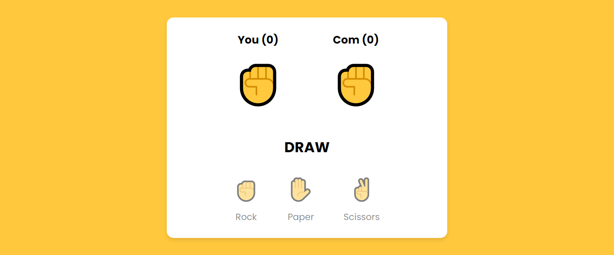

# Rock Paper Scissors Game with JavaScript

This is a simple Rock Paper Scissors game created using JavaScript programming language.

## How to Play

- Choose one of three options: rock, paper, or scissors.
- The computer will randomly choose one of these three options.
- The result of the game will be displayed, whether you win, lose, or draw.

## Features

- Simple and easy-to-understand JavaScript code.
- Use of functions to make the code more modular.
- Minimalist and responsive HTML and CSS code.

## How to Use

You can download or clone this repository to view the code and play the Rock Paper Scissors game that has been created. After that, you can run the `index.html` file in your browser to start playing.

## Example Screenshot

## Demo Link

You can try the game directly at [https://rizkyaidil.github.io/rock-paper-scissors-game-javascript/](https://rizkyaidil.github.io/rock-paper-scissors-game-javascript/).
